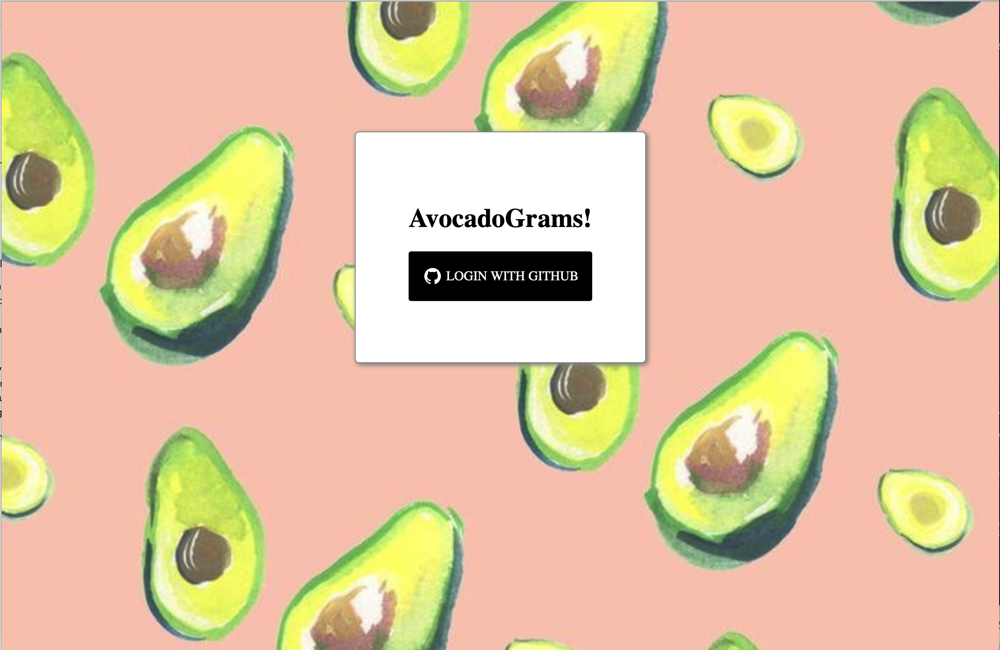
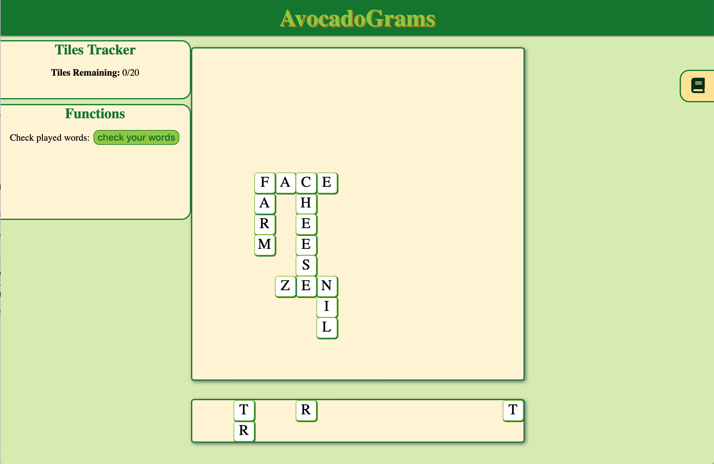
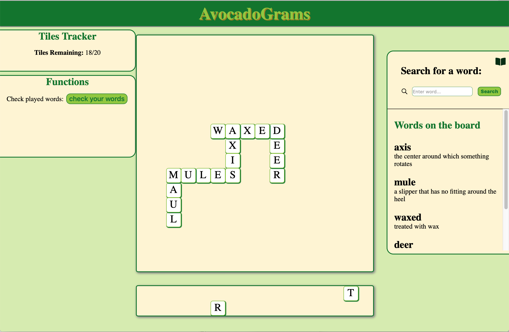

<h1 align="center">Avocadograms</h1>

## Features

#### When you first start the app, you'll be directed to log in through GitHub

    

#### Once logged in, you can place letters on the board

    

#### As you play, you can check whether the words you've placed exist by clicking the dictionary tab on the right

    

